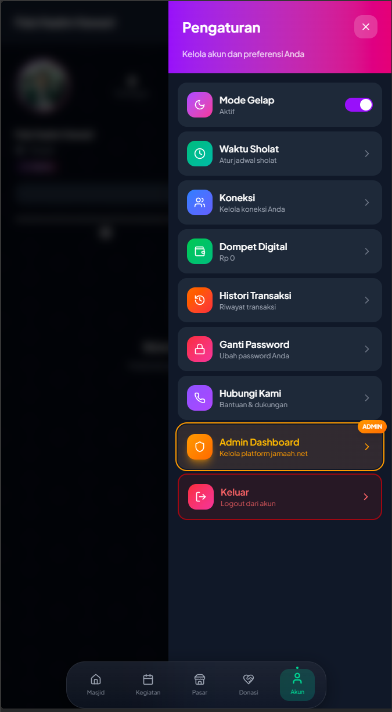

# 📱 Jamaah.net - Digital Community Ecosystem

<p align="center">
  
  &nbsp; 
  &nbsp; 
</p>

> **Platform digital terintegrasi yang menghubungkan komunitas Muslim untuk mengelola donasi, jual beli, dan aktivitas jamaah secara efisien dalam satu genggaman.**

---

## 📖 Tentang Aplikasi

**Jamaah.net** dikembangkan sebagai solusi digital komprehensif untuk menjawab kebutuhan ekosistem Muslim modern. Aplikasi ini berfungsi sebagai wadah sentral bagi jamaah dan pengurus masjid untuk berinteraksi, bertransaksi, dan mengelola program komunitas secara transparan.

---

## ✨ Fitur Utama

### 1. 📢 Digital Timeline & Informasi

- **Timeline Komunitas**: Sarana berbagi aktivitas dan konten edukasi antar sesama jamaah secara _real-time_.
- **Official Announcements**: Pusat informasi resmi dari pengurus untuk pengumuman penting yang mendesak.

### 2. 🛍️ Pasar Halal (Marketplace)

- **Pemberdayaan Ekonomi**: Fitur bagi jamaah untuk membuka toko dan berjualan produk halal langsung di dalam aplikasi.
- **Moderasi Produk**: Setiap unggahan barang melewati sistem kurasi Admin sebelum dipublikasikan untuk menjamin keamanan transaksi.

### 3. 💸 Donasi & Kampanye Sosial

- **Monitoring Transparan**: Jamaah dapat memantau progres penggalangan dana pembangunan atau santunan secara langsung.
- **Manajemen Donasi**: Memudahkan pengelolaan berbagai program bantuan sosial dalam satu platform.

### 4. 🛡️ Admin Command Center

Fitur eksklusif bagi pengelola dengan indikator **Verified Badge** untuk kendali penuh:

- **User Approval**: Validasi manual untuk setiap jamaah yang baru mendaftar (Status Pending/Active).
- **Moderasi Konten**: Otoritas penuh untuk menyetujui atau menghapus postingan, produk, dan jadwal kegiatan.
- **Data Management**: Pengelolaan basis data jamaah, termasuk pengaturan _role_ Admin dan Member.

---

## 🛠️ Tech Stack

Dibuat menggunakan teknologi terkini untuk memastikan performa yang optimal:

- **Frontend**: [React](https://react.dev/) + [Vite](https://vitejs.dev/) (Optimasi Mobile-Responsive)
- **Styling**: [Tailwind CSS](https://tailwindcss.com/) (Custom Dark Mode & UI Minimalis)
- **Backend/Database**: [Supabase](https://supabase.com/) (PostgreSQL, Auth, & Cloud Storage)
- **Icons**: [Lucide React](https://lucide.dev/)

---

## 💻 Panduan Instalasi & Pengembangan

### 1. Clone Repository

```bash
git clone [https://github.com/Zazaaw/Jamaahnet-Mobile.git](https://github.com/Zazaaw/Jamaahnet-Mobile.git)
cd jamaahnet-mobile
```

### 2. Install Dependencies

Pastikan Node.js sudah terinstall, lalu jalankan perintah ini untuk menginstall library yang dibutuhkan:

```bash
npm install
```

### 3. Server Development

Jalankan perintah berikut untuk menyalakan server lokal:

```bash
npm run dev
```

## 🤝 Tim Pengembang

Project ini dikembangkan dengan ❤️ untuk kemajuan umat oleh:

- **Aleaa** - Lead Developer & Frontend Developer
- **p441z** - UI/UX & Backend Logic

© 2026 Jamaah.net
